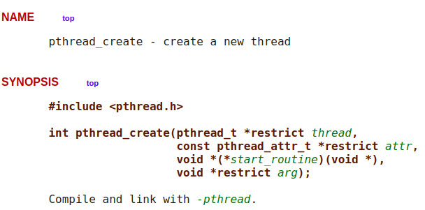

# Exemplos de manipulação de threads em C/C++

 
 
 
 

 

 

Neste pacote é disponibilizado três pequenos exemplos da utilização de threads em C/C++, os quais são desenvolvidos  a partir da biblioteca <b>pthreads.h</b>. Nessa biblioteca há um conjunto de diretrizes de configuração e controle de threads aplicáveis durante a execução para manter o fluxo de trabalho das mesmas, dentre as mais importântes tem-se:

>
> 1. _pthread_t_ : Handles para pthread que permitem nomear as threads a partir de um identificador único.
> 2. _pthread_attr_t_ : Conjunto de atributos para a configuração das threads antes da execução.
> 3. _pthread_func_ : Conjunto de funções responsaveis pelo gerenciamento a execução das threads, como: create, join, kill, exit. Para isso, considere substituir a diretriz <i>func</i> do título pelos nomes correspondentes.
>

Em conformidade com as diretrizes acima apresentadas, os exemplos abordados neste pacote seguem a dinâmica:

> 
> 
 <b>Ex1</b>: O exemplo 1 explora o modelo mais simples de implementação, contemplando a definição de uma única thread. Neste, a thread <i>monit</i> é definida para realizar a função <i>wait</i> disponível em <b>mythread.c</b>, a qual não recebe atributos via <i>pthread_attr_t</i> e/ou argumentos. Note que, por não receber tais valores há duas chamadas NULL na função <b>pthread_create</b>. Dentro da função <i>wait</i> a função create é novamente chamada, dessa vez para a realização da função <i>soma</i>. Nesta nova chamada, um argumento é passado para a thread executora, a <i>thread_a</i>, o qual é utilizado apenas para nomear a thread em execução. Por fim, observe no código da função <i>wait</i> que há uma declaração para a função <b>pthread_join</b>. Essa chamada recebe como parâmetro um ponteiro para a thread em execução e uma variável para armazenar a resposta da execução, a qual é enviada pela função <i>soma</i> por meio da chamada <b>pthread_exit</b>. A função <b>pthread_join</b> pode ser compreendida como um modelo de <i>"barreira"</i> em que todas as threads em execução são de certa forma aguardadas antes da finalização do programa. Sem essa ação, o programa terminaria e o resultado da thread em execução seria perdido. 

> 

Como definido na implementação do exemplo Ex1, a criação de threads é bem simples, basta chamar a função <b>pthread_create</b> e passar os <b>quatro</b> parâmetros esperados. A Fig 1 detalha a assinatura do método em questão.

 

 
Fig 1. Descrição do cabeçalho da chamada <b>pthread_create</b> segundo descrição apresentada em linux manual page. 

A partir da Fig 1 é possível observar que o método em questão retorna um valor do tipo inteiro. Se esse valor for zero, isso significa que a thread foi criada com sucesso. Caso contrário, um código de erro é emitido. Os códigos disponíveis, bem como, a descrição completa do método pode ser explorada em detalhes clicando <a href="https://man7.org/linux/man-pages/man3/pthread_create.3.html" target="_blank">AQUI</a>.

	Como pode ser observado por meio da discussão acima, a definição de threads e o controle das mesmas não é uma tarefa muito complexa. Contudo, no Ex1 definimos apenas uma thread para modelar o caso básico. Embora seja viável didaticamente, essa condição não se encaixa adequadamente em problemas reais, os quais demandam a criação de múltiplas threads. Para representar um ambiente multithread, explore a implementação do exemplo Ex2. 

>
> **Ex2**: Neste exemplo detalhamos como se realiza a criação e gerencia de múltiplas threads. Aproveitamos o exemplo para detalhar um problema associado a utilização de várias threads em paralelo, o controle de concorrência e o compartilhamento de espaço de memória entre múltiplas threads. Note pelo Ex2 que definimos um par de funções chamadas _routineX_ e _waitX_ com X como P para execução com problema e C para a realização correta da execução. A função desse exemplo é bem simples, cada thread deve chamar sua função _routineX_ respectiva e imprimir na tela uma entre dez posições de um vetor. No exemplo com problemas (i.e., P) as threads compartilham a mesma variável **i**, a qual produz o problema a ser exposto. Note que, ao realizar a execução a variável vai sendo modificada em sua thread primária, o que influencia diretamente a posição explorada pelas threads executoras da função _routineP_. Para corrigir esse problema de variável compartilhada, criamos em _waitC_ uma **variável de backup** não compartilhada. Isso evita que o valor de **i** seja modificado antes da utilização do mesmo pela thread executora. 
>

No exemplo Ex2, lidamos com o controle concorrente de forma simplória, realizando uma cópia da variável compartilhada para evitar a modificação de seu valor durante a realização da thread. Oberve que passamos essa variável para a chamada da thread, utilizando para isso o quarto argumento da chamada  <b>pthread_create</b>. A questão agora é: Como tratar com a submissão de múltiplos parâmetros para uma chamada do tipo thread, uma vez que essas sempre recebem um único ponteiro do tipo void *args, conforme implementações já apresentadas? Para responder essa questão, vide Ex3. 

>
> **Ex3**: No exemplo 3 estendemos os exemplos já apresentados, inserindo de novo a possibilidade de manipulação de uma struct dentro de cada nova thread. Note também que utilizamos um vetor de thrads do tipo _pthread_t_ para controlar as múltiplas threads implementadas. Como pode ser observado pelo exemplo, ao receber um argumento do tipo ponteiro void, basta realizar um processo de conversão padrão ou cast para ter acesso a qualquer tipo de variável necessária à manipulação. Isso flexibiliza as implementações ao mesmo tempo que permite o usuário modificar seu código de forma rápida sem a necessidade de reimplementação completa devido a mudança de passagem de parâmetros. Além disso, torna-se possível a passagem de vetores, como o caso definido em Ex3, com múltiplas informações, com uma TAD por posição por exmeplo. 
>

# Compilação e Execução

Os exemplos disponibilizados possuem um arquivo Makefile que realiza todo o procedimento de compilação e execução. Para tanto, temos as seguintes diretrizes de execução:

| Comando                |  Função                                                                                           |                     
| -----------------------| ------------------------------------------------------------------------------------------------- |
|  `make clean`          | Apaga a última compilação realizada contida na pasta build                                        |
|  `make`                | Executa a compilação do programa utilizando o gcc, e o resultado vai para a pasta build           |
|  `make run`            | Executa o programa da pasta build após a realização da compilação                                 |

# Contatos

 

<a style="color:black" href="mailto:michel@cefetmg.br?subject=[GitHub]%20Source%20Dynamic%20Lists">
✉️ <i>michel@cefetmg.br</i>
</a>

